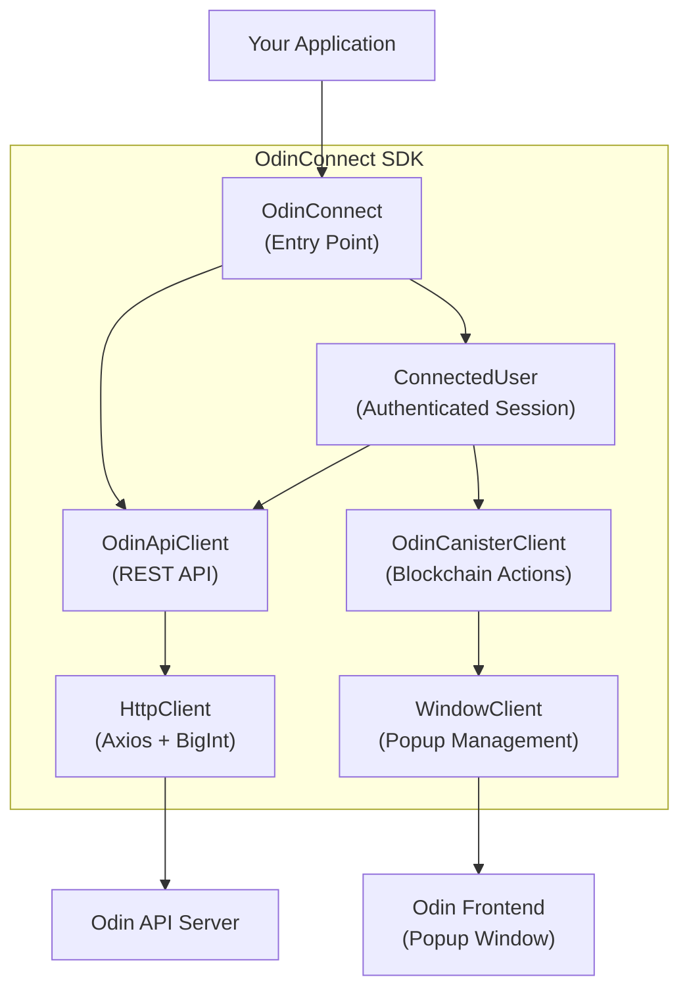
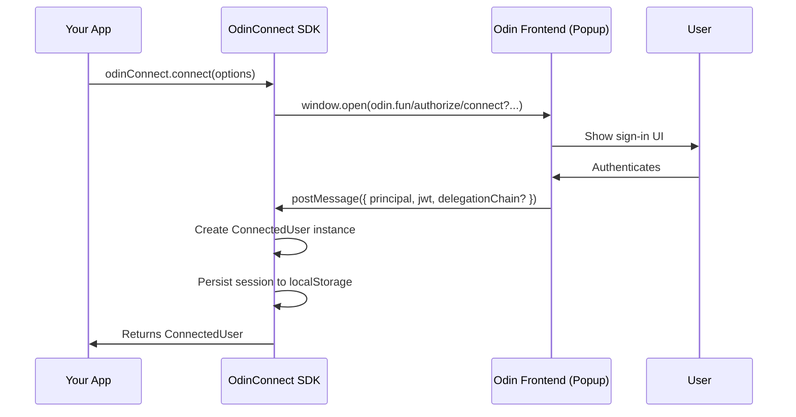
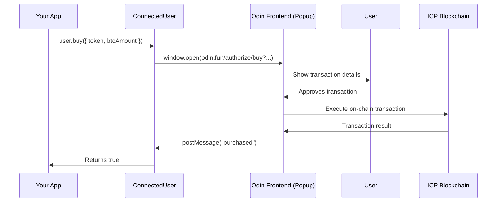
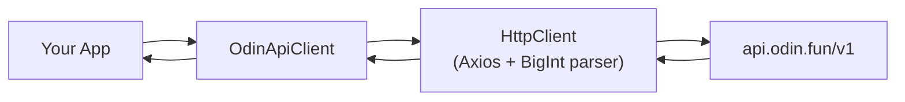

# OdinConnect

A TypeScript SDK for integrating with the [Odin](https://odin.fun) decentralized token platform on the Internet Computer (ICP). OdinConnect handles user authentication, token trading, liquidity management, and API interactions through a simple, promise-based interface.

## Table of Contents

- [Installation](#installation)
- [Architecture](#architecture)
- [How It Works](#how-it-works)
  - [Authentication Flow](#authentication-flow)
  - [Trading Action Flow](#trading-action-flow)
  - [API Request Flow](#api-request-flow)
- [Getting Started](#getting-started)
- [Authentication](#authentication)
- [Session Restoration](#session-restoration)
- [Connected User Operations](#connected-user-operations)
  - [Fetching User Data](#fetching-user-data)
  - [Trading](#trading)
  - [Liquidity](#liquidity)
  - [Token Creation](#token-creation)
- [Public API](#public-api)
  - [Tokens](#tokens)
  - [Users](#users)
- [Utilities](#utilities)
- [Configuration](#configuration)
- [Types](#types)
- [Demo](#demo)
- [General Notes](#general-notes)

## Installation

```bash
npm i odin-connect
```

## Architecture

OdinConnect is built with a layered architecture. Your application interacts with the `OdinConnect` class, which delegates to specialized internal services:



| Component | Role |
|-----------|------|
| **OdinConnect** | Main entry point. Initializes the SDK with your app info and environment. |
| **ConnectedUser** | Returned after authentication. Provides user-scoped data fetching and trading actions. |
| **OdinApiClient** | Handles all REST API calls to `api.odin.fun`. Available both on the instance (`odinConnect.api`) and on the connected user. |
| **OdinCanisterClient** | Manages popup-based authorization for blockchain actions (buy, sell, transfer, etc.). |
| **WindowClient** | Wraps `window.open()` for cross-origin popup communication via `postMessage`. |
| **HttpClient** | Axios wrapper with automatic BigInt deserialization for large number fields. |

## How It Works

### Authentication Flow

When your app calls `connect()`, a popup opens to the Odin frontend where the user signs in. On success, user credentials are passed back to your app via `postMessage`.



**What gets returned depends on your options:**

| Option | What You Get |
|--------|-------------|
| `requires_api: true` | A JWT token for authenticated API calls (image uploads, etc.) |
| `requires_delegation: true` | A `DelegationIdentity` for direct canister calls |
| Neither | Basic connection with user's principal |

### Trading Action Flow

Trading operations (buy, sell, transfer, swap, liquidity) each open a popup for the user to authorize the transaction:



If the user rejects the transaction, the popup sends `"rejected"` and the promise resolves to `false`.

### API Request Flow

API calls go through the HttpClient, which automatically handles BigInt deserialization for fields like `marketcap`, `volume`, and `balance`:



## Getting Started

```typescript
import { OdinConnect } from "odin-connect";

// 1. Initialize
const odinConnect = new OdinConnect({
  name: "My App",
  env: "prod",
});

// 2. Restore existing session or authenticate
let user = odinConnect.restoreSession();
if (!user) {
  user = await odinConnect.connect({ requires_api: true });
}

// 3. Fetch data
const balances = await user.getBalances({ page: 1, limit: 10 });

// 4. Perform actions
await user.buy({ token: "2jjj", btcAmount: 10_000_000n });
```

## Authentication

### Initializing a new instance

```typescript
const odinConnect = new OdinConnect({
  name: "Demo App",   // Your app name (shown in auth popup)
  env: "prod",        // "prod" | "dev" | "local"
});
```

### Connecting a user

```typescript
const user = await odinConnect.connect({
  // window.open() settings for the auth popup
  open: {
    target: "_blank",
    settings: "height=800,width=400",
  },
  // Request a JWT for authenticated API calls
  requires_api: true,
  // Request a DelegationChain for direct canister interaction
  requires_delegation: false,
});
```

### Getting a Delegation Identity

If you need to make direct calls to ICP canisters, request a delegation:

```typescript
const user = await odinConnect.connect({
  requires_delegation: true,
  targets: ["aaaa-aa"], // Canister IDs the delegation is scoped to
});

const identity = user.getIdentity();
// Use identity with @dfinity/agent
```

## Session Restoration

OdinConnect automatically persists session data to `localStorage` after a successful `connect()`. This allows you to restore sessions on page load without requiring user action.

### Restoring a session

```typescript
const odinConnect = new OdinConnect({ name: "My App", env: "prod" });

// Attempt to restore a previous session (synchronous, no popup)
const user = odinConnect.restoreSession();
if (user) {
  // Session restored — user is ready
  const balances = await user.getBalances({ page: 1, limit: 10 });
} else {
  // No valid session — prompt the user to connect
  const user = await odinConnect.connect({ requires_api: true });
}
```

### Checking session validity

```typescript
if (odinConnect.isSessionValid()) {
  // A non-expired session exists in storage
}
```

### Disconnecting

```typescript
// Clears persisted session data and resets the API key
odinConnect.disconnect();
```

### Custom app slug

Storage keys are scoped by a slug derived from your app name (e.g. `"My App"` becomes `"my-app"`). You can provide a custom slug to control the storage key:

```typescript
const odinConnect = new OdinConnect({
  name: "My App",
  slug: "myapp-v2", // Storage key: odin_connect:myapp-v2:prod:session
  env: "prod",
});
```

> **Notes:**
> - Sessions with a delegation chain are automatically invalidated when the delegation expires.
> - Calling `disconnect()` in one tab clears the session for all tabs on the same origin.
> - In environments where `localStorage` is unavailable (SSR, strict privacy mode), session persistence is silently skipped.

## Connected User Operations

After calling `connect()`, you receive a `ConnectedUser` with the following capabilities:

### Fetching User Data

All data methods accept a `{ page, limit }` pagination object:

```typescript
const profile       = await user.getUser();
const balances      = await user.getBalances({ page: 1, limit: 10 });
const balance       = await user.getBalance("2jjj"); // Single token balance (or null)
const tokens        = await user.getTokens({ page: 1, limit: 10 });
const createdTokens = await user.getCreatedTokens({ page: 1, limit: 10 });
const liquidity     = await user.getLiquidity({ page: 1, limit: 10 });
const activity      = await user.getActivity({ page: 1, limit: 10 });
const achievements  = await user.getAchievements({ page: 1, limit: 10 });
const transactions  = await user.getTransactions({ page: 1, limit: 10 });
const stats         = await user.getStats();
const avatarUrl     = user.buildAvatarImageUrl(); // sync, env-aware CDN URL
```

#### Getting the BTC balance

BTC is a regular token with the id `"btc"`, so fetch it with `getBalance`:

```typescript
// Connected user
const btc = await user.getBalance("btc"); // Balance | null (null = no BTC held)

// Or with the read-only API client (no auth required)
const btc = await odinConnect.api.getBalance(principal, "btc");
```

`balance` is a `bigint` in **millisatoshis** (1 BTC = 100,000,000,000 millisats).
Convert to BTC for display:

```typescript
const asBtc = btc ? Number(btc.balance) / 1e11 : 0;
```

> See [General Notes](#general-notes) — all BTC amounts are in millisatoshis.

### Trading

#### Buy tokens

```typescript
await user.buy({
  btcAmount: 10_000_000n, // Amount in millisatoshis
  token: "2jjj",
});
```

#### Sell tokens

```typescript
await user.sell({
  tokenAmount: 20_000_000n,
  token: "2jjj",
});
```

#### Transfer tokens

```typescript
await odinConnect.transfer({
  principal: "veyov-kjgrf-hke6v-6d63i-sdwae-oldgg-huau6-ke5g3-rllp2-5jhca-uqe",
  destination: "vv5jb-7sm7u-vn3nq-6nflf-dghis-fd7ji-cx764-xunni-zosog-eqvpw-oae",
  token: "2jjj",
  amount: 20_000_000n,
});
```

#### Swap tokens

```typescript
await user.swap({
  fromToken: "2jjj",
  toToken: "abc1",
  fromAmount: 10_000_000n,
});
```

#### Approve a spender (ICRC-2)

Authorizes a `spender` to transfer up to `amount` of a token on the user's behalf. The user's `principal` is supplied automatically from the connected session.

```typescript
await user.icrcApprove({
  token: "2jjj",       // Token to approve
  spender: "veyov-kjgrf-hke6v-6d63i-sdwae-oldgg-huau6-ke5g3-rllp2-5jhca-uqe", // Principal allowed to spend
  amount: 20_000_000n, // Allowance in millisatoshis
});
```

### Liquidity

#### Add liquidity

```typescript
await user.addLiquidity({
  btcAmount: 20_000_000n,
  token: "2jj",
});
```

#### Remove liquidity

```typescript
await user.removeLiquidity({
  btcAmount: 20_000_000n,
  token: "2jj",
});
```

### Token Creation

> **Note:** `requires_api` must be set to `true` when connecting.

```typescript
const user = await odinConnect.connect({ requires_api: true });

await user.createToken({
  image: file,        // A File (PNG, JPEG, WebP, GIF, SVG, or AVIF; max 200KB)
  principal: "veyov-kjgrf-hke6v-6d63i-sdwae-oldgg-huau6-ke5g3-rllp2-5jhca-uqe",
  name: "Test Token",       // 3-30 characters
  ticker: "TEST",           // 3-10 uppercase alphanumeric, at least 2 letters
  description: "A test token",  // Optional, max 100 characters
  website: "https://example.com",  // Optional, valid URL
  telegram: "",             // Optional, valid Telegram URL
  twitter: "",              // Optional, valid Twitter/X URL
  buy: 20_000_000n,         // Optional, pre-buy amount in millisats
  discount: "",             // Optional, 10 alphanumeric characters
});
```

## Public API

The API client is available at `odinConnect.api` and does **not** require authentication for read operations.

### Tokens

```typescript
// List tokens with sorting and filtering
const tokens = await odinConnect.api.getTokens(
  { page: 1, limit: 10 },         // Pagination
  { field: "marketcap", direction: "desc" },  // Sort (optional)
  { marketcap_min: 100_000_000n }  // Filters (optional)
);

// Get a single token by ID
const token = await odinConnect.api.getToken("2jjj");
```

**Available sort fields:** `marketcap`, `volume`, `price`, `holder_count`, `created_time`

**Available filters:**

| Filter | Type | Description |
|--------|------|-------------|
| `ascended` | `boolean` | Token has ascended |
| `etched` | `boolean` | Token has been etched |
| `external` | `boolean` | External (Bitcoin) token |
| `verified` | `boolean` | Verified token |
| `has_website` | `boolean` | Has a website |
| `has_twitter` | `boolean` | Has a Twitter account |
| `has_telegram` | `boolean` | Has a Telegram group |
| `marketcap_min` / `marketcap_max` | `bigint` | Market cap range (millisats) |
| `volume_min` / `volume_max` | `bigint` | Volume range (millisats) |
| `holders_min` / `holders_max` | `number` | Holder count range |
| `price_min` / `price_max` | `number` | Price range |
| `search` | `string` | Search by name or ticker |

### Users

```typescript
// Get activities (no principal required)
const activity = await odinConnect.api.getUserActivity({
  pagination: { page: 1, limit: 10 },
});

// Get token by id
const token = await odinConnect.api.getToken("2jjj");

// Get user profile by id
const user = await odinConnect.api.getUser(
  "veyov-kjgrf-hke6v-6d63i-sdwae-oldgg-huau6-ke5g3-rllp2-5jhca-uqe"
);

// Get user balances by user id
const balances = await odinConnect.api.getBalances(
  "veyov-kjgrf-hke6v-6d63i-sdwae-oldgg-huau6-ke5g3-rllp2-5jhca-uqe",
  { page: 1, limit: 20 }
);

// Get balance for a specific token (returns Balance or null)
const balance = await odinConnect.api.getBalance(
  "veyov-kjgrf-hke6v-6d63i-sdwae-oldgg-huau6-ke5g3-rllp2-5jhca-uqe",
  "2jjj"
);

// Get activities by user id
const activity = await odinConnect.api.getUserActivity(
  "veyov-kjgrf-hke6v-6d63i-sdwae-oldgg-huau6-ke5g3-rllp2-5jhca-uqe",
  { page: 1, limit: 10 }
);

// Get transactions by user id
const transactions = await odinConnect.api.getUserTransactions(
  "veyov-kjgrf-hke6v-6d63i-sdwae-oldgg-huau6-ke5g3-rllp2-5jhca-uqe",
  { page: 1, limit: 10 }
);

// Get user stats
const stats = await odinConnect.api.getUserStats(
  "veyov-kjgrf-hke6v-6d63i-sdwae-oldgg-huau6-ke5g3-rllp2-5jhca-uqe"
);
```

## Utilities

OdinConnect exports utility functions under `OdinUtils`:

```typescript
import { OdinUtils } from "odin-connect";

// Convert a decimal amount to the on-chain bigint representation
const amount = OdinUtils.convertToOdinAmount("1.5", token);
// For a token with decimals=3, divisibility=8 → 150_000_000_000n
```

### Token Field Validators

Validators are available for token creation fields:

```typescript
import { OdinUtils } from "odin-connect";

OdinUtils.createTokenValidators.name("My Token");        // 3-30 chars
OdinUtils.createTokenValidators.ticker("TEST");           // 3-10 uppercase alphanumeric
OdinUtils.createTokenValidators.image(file);              // PNG/JPEG/WebP/GIF/SVG/AVIF, max 200KB
OdinUtils.createTokenValidators.description("A token");   // Max 100 chars
OdinUtils.createTokenValidators.website("https://...");   // Valid URL
OdinUtils.createTokenValidators.twitter("https://x.com/...");
OdinUtils.createTokenValidators.telegram("https://t.me/...");
```

## Configuration

### Environments

| Environment | Frontend URL | API Base URL |
|-------------|-------------|-------------|
| `prod` (default) | `https://odin.fun` | `https://api.odin.fun/v1` |
| `dev` | `https://dev.odin.fun` | `https://api.odin.fun/dev` |
| `local` | `http://localhost:5173` | `https://api.odin.fun/dev` |

```typescript
const odinConnect = new OdinConnect({
  name: "My App",
  env: "dev", // Use development environment
});
```

## Types

All types are exported with the `Odin` prefix:

```typescript
import type {
  OdinUser,
  OdinBalance,
  OdinBaseToken,
  OdinToken,
  OdinTokenWithBalance,
  OdinActivity,
  OdinTransaction,
  OdinAchievement,
  OdinAchievementCategory,
  OdinConnectedUser,
  SessionData,
} from "odin-connect";
```

## Demo

This repository includes a working demo application in the `/demo` folder.

```bash
# Build the library and start the demo dev server
npm run demo

# Or run just the demo (if already built)
npm run demo:start
```

## General Notes

- All BTC amounts are in **millisatoshis** (1 BTC = 100,000,000,000 millisats)
- All trading actions (buy, sell, transfer, swap, liquidity) open a popup for user authorization and return a `boolean`
- API data methods return paginated results; pass `{ page, limit }` to control pagination
- The SDK uses `postMessage` for secure cross-origin communication between your app and the Odin frontend popup
- BigInt fields (balances, amounts, market caps) are automatically deserialized from JSON
