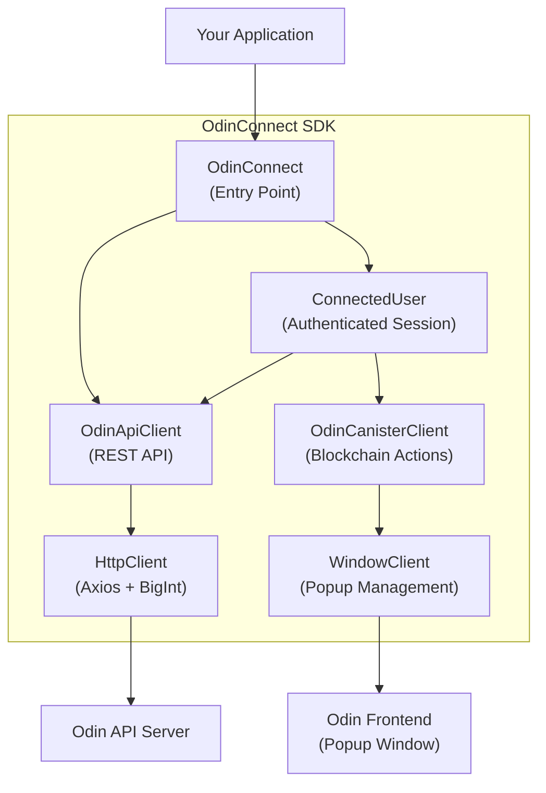
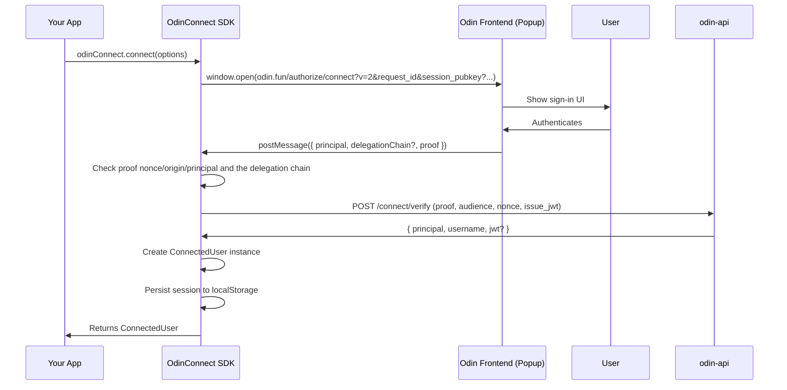
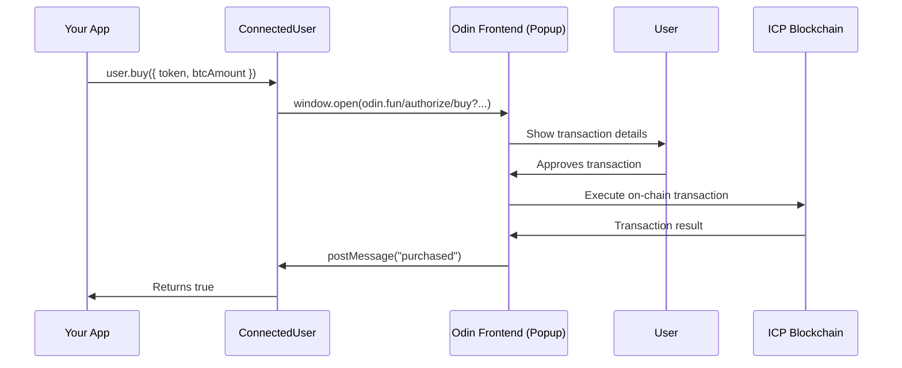
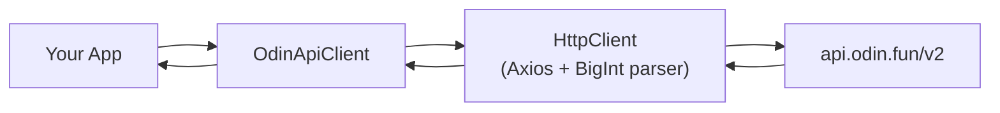

# OdinConnect

A TypeScript SDK for integrating with the [Odin](https://odin.fun) decentralized token platform on the Internet Computer (ICP). OdinConnect handles user authentication, token trading, liquidity management, and API interactions through a simple, promise-based interface.

## Table of Contents

- [Installation](#installation)
- [Architecture](#architecture)
- [How It Works](#how-it-works)
  - [Authentication Flow](#authentication-flow)
  - [Trading Action Flow](#trading-action-flow)
  - [API Request Flow](#api-request-flow)
- [Getting Started](#getting-started)
- [Authentication](#authentication)
  - [Verified connect](#verified-connect)
- [Session Restoration](#session-restoration)
- [Migrating to 2.0.0](#migrating-to-200)
- [Connected User Operations](#connected-user-operations)
  - [Fetching User Data](#fetching-user-data)
  - [Trading](#trading)
  - [Liquidity](#liquidity)
  - [Token Creation](#token-creation)
- [Public API](#public-api)
  - [Tokens](#tokens)
  - [Users](#users)
- [Utilities](#utilities)
- [Configuration](#configuration)
- [Types](#types)
- [Demo](#demo)
- [Starter Template](#starter-template)
- [General Notes](#general-notes)

## Installation

```bash
npm i odin-connect
```

## Architecture

OdinConnect is built with a layered architecture. Your application interacts with the `OdinConnect` class, which delegates to specialized internal services:


```mermaid
graph TB
    App["Your Application"]

    subgraph OdinConnect SDK
        OC["OdinConnect<br/>(Entry Point)"]
        CU["ConnectedUser<br/>(Authenticated Session)"]
        API["OdinApiClient<br/>(REST API)"]
        CAN["OdinCanisterClient<br/>(Blockchain Actions)"]
        WIN["WindowClient<br/>(Popup Management)"]
        HTTP["HttpClient<br/>(Axios + BigInt)"]
    end

    OdinAPI["Odin API Server"]
    OdinFE["Odin Frontend<br/>(Popup Window)"]

    App --> OC
    OC --> CU
    OC --> API
    CU --> API
    CU --> CAN
    CAN --> WIN
    WIN --> OdinFE
    API --> HTTP
    HTTP --> OdinAPI
```

| Component | Role |
|-----------|------|
| **OdinConnect** | Main entry point. Initializes the SDK with your app info and environment. |
| **ConnectedUser** | Returned after authentication. Provides user-scoped data fetching and trading actions. |
| **OdinApiClient** | Handles all REST API calls to `api.odin.fun`. Available both on the instance (`odinConnect.api`) and on the connected user. |
| **OdinCanisterClient** | Manages popup-based authorization for blockchain actions (buy, sell, transfer, etc.). |
| **WindowClient** | Wraps `window.open()` for cross-origin popup communication via `postMessage`. |
| **HttpClient** | Axios wrapper with automatic BigInt deserialization for large number fields. |

## How It Works

### Authentication Flow

When your app calls `connect()`, a popup opens to the Odin frontend where the user signs in. On success, Odin posts back the principal, a delegation chain (if requested) and a signed identity proof; the SDK verifies the proof with odin-api before it returns a user (see [Verified connect](#verified-connect)).


```mermaid
sequenceDiagram
    participant App as Your App
    participant SDK as OdinConnect SDK
    participant Popup as Odin Frontend (Popup)
    participant User as User

    participant API as odin-api

    App->>SDK: odinConnect.connect(options)
    SDK->>Popup: window.open(odin.fun/authorize/connect?v=2&request_id&session_pubkey?...)
    Popup->>User: Show sign-in UI
    User->>Popup: Authenticates
    Popup->>SDK: postMessage({ principal, delegationChain?, proof })
    SDK->>SDK: Check proof nonce/origin/principal and the delegation chain
    SDK->>API: POST /connect/verify (proof, audience, nonce, issue_jwt)
    API->>SDK: { principal, username, jwt? }
    SDK->>SDK: Create ConnectedUser instance
    SDK->>SDK: Persist session to localStorage
    SDK->>App: Returns ConnectedUser
```

**What gets returned depends on your options:**

| Option | What You Get |
|--------|-------------|
| `requires_api: true` | A JWT for authenticated API calls (image uploads, etc.), issued by odin-api after verification |
| `requires_delegation: true` | A `DelegationIdentity` for direct canister calls |
| Neither | Basic connection with user's principal |

### Trading Action Flow

Trading operations (buy, sell, transfer, swap, liquidity) each open a popup for the user to authorize the transaction:


```mermaid
sequenceDiagram
    participant App as Your App
    participant SDK as ConnectedUser
    participant Popup as Odin Frontend (Popup)
    participant User as User
    participant Chain as ICP Blockchain

    App->>SDK: user.buy({ token, btcAmount })
    SDK->>Popup: window.open(odin.fun/authorize/buy?...)
    Popup->>User: Show transaction details
    User->>Popup: Approves transaction
    Popup->>Chain: Execute on-chain transaction
    Chain->>Popup: Transaction result
    Popup->>SDK: postMessage("purchased")
    SDK->>App: Returns true
```

If the user rejects the transaction, the popup sends `"rejected"` and the promise resolves to `false`.

Every authorize URL carries `v=2` and a fresh, random `request_id`. For
`icrcApprove()`, Odin sets the ICRC-2 memo to `sha256(request_id)`; in
redirect mode the result exposes the ledger block index as
`result.detail.block_index` (decimal string) and `result.detail.memo` (hex).
The popup `icrcApprove()` still resolves `true`.

### API Request Flow

API calls go through the HttpClient, which automatically handles BigInt deserialization for fields like `marketcap`, `volume`, and `balance`:


```mermaid
flowchart LR
    A["Your App"] --> B["OdinApiClient"]
    B --> C["HttpClient<br/>(Axios + BigInt parser)"]
    C --> D["api.odin.fun/v2"]
    D --> C
    C --> B
    B --> A
```

## Getting Started

```typescript
import { OdinConnect } from "odin-connect";

// 1. Initialize
const odinConnect = new OdinConnect({
  name: "My App",
  env: "prod",
});

// 2. Restore existing session or authenticate
let user = odinConnect.restoreSession();
if (!user) {
  user = await odinConnect.connect({ requires_api: true });
}

// 3. Fetch data
const balances = await user.getBalances({ page: 1, limit: 10 });

// 4. Perform actions
await user.buy({ token: "2jjj", btcAmount: 10_000_000n });
```

## Authentication

### Initializing a new instance

```typescript
const odinConnect = new OdinConnect({
  name: "Demo App",   // Your app name (shown in auth popup)
  env: "prod",        // "prod" | "dev" | "local" | "legacy"
  lang: "en",         // Popup UI language: "en" | "zh" (default "en")
});
```

### Popup language

All auth and action popups render in the language set via `lang`. It can be
changed at runtime; the new value applies to the next popup opened:

```typescript
const odinConnect = new OdinConnect({ name: "Demo App", lang: "zh" });

odinConnect.lang = "en"; // next popup renders in English
```

Unsupported values fall back to `"en"`. The SDK does not persist `lang` —
pass it on each construction from your app's own i18n state.

### Connecting a user

```typescript
const user = await odinConnect.connect({
  // window.open() settings for the auth popup
  open: {
    target: "_blank",
    settings: "height=800,width=400",
  },
  // Request a JWT for authenticated API calls
  requires_api: true,
  // Request a DelegationChain for direct canister interaction
  requires_delegation: false,
});
```

### Getting a Delegation Identity

If you need to make direct calls to ICP canisters, request a delegation:

```typescript
const user = await odinConnect.connect({
  requires_delegation: true,
  targets: ["aaaa-aa"], // Canister IDs the delegation is scoped to
});

const identity = user.getIdentity();
// Use identity with @dfinity/agent
```

> [!IMPORTANT]
> **Every target canister must trust your app's origin.** Each canister listed in `targets` must return your app's origin from its [`icrc28_trusted_origins()`](https://github.com/dfinity/wg-identity-authentication) method. The Odin frontend verifies this against **all** targets before issuing a delegation.
>
> **Failure mode:** if any target does not list your origin (or does not implement ICRC-28), the authorize popup silently hides the action — no delegation is issued and no error is surfaced to your app. Ensure each target canister declares your origin before requesting `requires_delegation: true`.

### Verified connect

Since 2.0.0 a connect result is never taken on trust. A forged "connected as
X" (devtools, a crafted URL fragment) is rejected:

1. The session key is generated in your page and **only its public key** is
   sent to Odin (`session_pubkey`). The secret never leaves the SDK.
2. Odin signs an identity proof with the user's Odin identity, bound to your
   origin (`aud`) and to this request (`request_id` nonce).
3. With `requires_delegation`, the SDK checks the chain locally: not expired,
   issued to its own session key, rooted at the reported principal, and only
   scoped to the `targets` you asked for.
4. The SDK posts the proof to odin-api `POST /connect/verify` (on the same
   base URL as the other API calls) with `audience: window.location.origin`,
   `nonce: request_id` and `issue_jwt: requires_api`. odin-api verifies the
   signature (including Internet Identity canister signatures), rejects
   replays and returns `{ principal, username, jwt }`. The principal must
   match.
5. Only then is the user returned and persisted. With `requires_api`, the JWT
   comes from that API response; it never travels in a URL or `postMessage`.

If any step fails, popup `connect()` rejects with an
`OdinConnectVerificationError` ("OdinConnect could not verify the
connection: ...") and redirect mode reports
`{ action: "connect", status: "unverified", error }`. Nothing is stored.

### Wallet in-app browsers (redirect mode)

Some wallet in-app browsers (OKX) open `window.open` targets as a detached
page with no `window.opener`, so a popup can never send its result back.
Set `mode` on the instance; it applies to `connect()` **and every action**
(buy, sell, transfer, swap, liquidity, ICRC-2 approve, create token):

```typescript
const odinConnect = new OdinConnect({
  name: "My App",
  env: "prod",
  mode: "auto", // "popup" (default) | "redirect" | "auto" (redirect in wallet browsers)
});

// On page load: read the outcome of the redirect this load returned from.
// Async: a connect result is verified with odin-api first.
try {
  const result = await odinConnect.handleRedirectResult();
  if (result?.action === "connect" && result.status === "connected") {
    user = result.user;
  } else if (result?.action === "connect" && result.status === "unverified") {
    // Odin's answer could not be verified (result.error). Not connected.
  } else if (result?.action === "connect") {
    // Rejected. Show that, and do NOT call connect() automatically on this
    // load, or a user who taps Reject is sent straight back to Odin.
  } else if (result) {
    // An action: { action: "buy", status: "success" | "failed", detail? }
  }
} catch (error) {
  // Stale or foreign result; ignore.
}
// Then the stored session (restoreSession() does not read redirect results).
user ??= odinConnect.restoreSession();

// From a button click. In redirect mode these navigate this tab to Odin and
// back, and the promise never settles; the outcome arrives via
// handleRedirectResult() above.
await odinConnect.connect({ requires_delegation: true, targets: ["aaaa-aa"] });
await user.buy({ token: "2jjj", btcAmount: 10_000_000n });
```

- `mode` can be changed at runtime: `odinConnect.mode = "redirect"`.
- The result comes back in the URL fragment of the page that started the
  request. `handleRedirectResult()` checks it against a one-time nonce kept
  in `sessionStorage` (sent as both `state` and `request_id`), removes it from
  the address bar and, for connect, verifies it like a popup connect.
- `restoreSession()` never reads redirect results: always
  `await handleRedirectResult()` first.
- Page state is lost across the round trip. Pass what the page needs to
  resume as `returnState` (see below).
- `requires_api` works in redirect mode: the JWT comes from odin-api, never
  from the URL.
- Odin only redirects back to registered apps (exact origin and path) and to
  `localhost` during development. Ask Odin to register your origin and
  redirect path before you ship redirect mode.
- `"auto"` redirects when `isInAppBrowser()` is true: a known wallet user
  agent (OKX), an app webview (Android `; wv)`, iOS WebKit without
  `Safari/`), or a mobile browser with an injected wallet (`XverseProviders`,
  `btc_providers`, `unisat`, `okxwallet`, `phantom`, `ethereum`, ...). It errs
  toward redirect, which works everywhere. Call `isInAppBrowser()` yourself
  if you want to choose the mode.

#### Resuming after a redirect (`returnState`)

In redirect mode the page reloads, so an awaited `connect()` / action never
returns and in-memory state is gone. Pass anything you need to continue as
`returnState`; it is kept with the one-time nonce in `sessionStorage` (never
sent to Odin) and comes back on `handleRedirectResult()`. Any JSON value
works, and bigints are preserved. In popup mode it is ignored and the awaited
call resolves as usual, so the same code works in both modes:

```typescript
type Resume = { step: "approve"; token: string; amount: bigint };

// 1. Start the action with what the page needs to resume.
const ok = await user.icrcApprove({
  token,
  spender,
  amount,
  returnState: { step: "approve", token, amount } satisfies Resume,
});
if (ok) goToStep("commit"); // popup mode lands here

// 2. On page load (redirect mode lands here instead).
const result = await odinConnect.handleRedirectResult<Resume>();
if (result?.action === "icrc_approve" && result.returnState) {
  const { token, amount } = result.returnState;
  if (result.status === "success") {
    // result.detail?.block_index: ledger block of the approval
    goToStep("commit", { token, amount });
  } else showError("Approval was rejected");
}
```

## Session Restoration

OdinConnect automatically persists session data to `localStorage` after a successful `connect()`. This allows you to restore sessions on page load without requiring user action.

### Restoring a session

```typescript
const odinConnect = new OdinConnect({ name: "My App", env: "prod" });

// In redirect mode, `await odinConnect.handleRedirectResult()` first.
// Attempt to restore a previous session (synchronous, no popup)
const user = odinConnect.restoreSession();
if (user) {
  // Session restored — user is ready
  const balances = await user.getBalances({ page: 1, limit: 10 });
} else {
  // No valid session — prompt the user to connect
  const user = await odinConnect.connect({ requires_api: true });
}
```

### Checking session validity

```typescript
if (odinConnect.isSessionValid()) {
  // A non-expired session exists in storage
}
```

### Disconnecting

```typescript
// Clears persisted session data and resets the API key
odinConnect.disconnect();
```

### Custom app slug

Storage keys are scoped by a slug derived from your app name (e.g. `"My App"` becomes `"my-app"`). You can provide a custom slug to control the storage key:

```typescript
const odinConnect = new OdinConnect({
  name: "My App",
  slug: "myapp-v2", // Storage key: odin_connect:myapp-v2:prod:session
  env: "prod",
});
```

> **Notes:**
> - Sessions with a delegation chain are automatically invalidated when the delegation expires.
> - Calling `disconnect()` in one tab clears the session for all tabs on the same origin.
> - In environments where `localStorage` is unavailable (SSR, strict privacy mode), session persistence is silently skipped.

## Migrating to 2.0.0

2.0.0 makes connect results verifiable and stops sending secrets through
URLs. It needs the Odin frontend and odin-api that support `v=2` (already
deployed before this release).

- **`handleRedirectResult()` is async.** It returns
  `Promise<OdinRedirectResult | null>` and rejects (instead of throwing) on a
  stale or foreign result. Replace `odinConnect.handleRedirectResult()` with
  `await odinConnect.handleRedirectResult()`.
- **`restoreSession()` no longer handles redirect results.** It stays
  synchronous and only reads storage. Call `await handleRedirectResult()`
  first on page load, then `restoreSession()`.
- **New connect status `"unverified"`** (`{ action: "connect", status:
  "unverified", error: string }`): the result could not be verified, the user
  is not connected and nothing was stored. Popup `connect()` rejects with an
  `OdinConnectVerificationError` in the same cases.
- **`requires_api` is allowed in redirect mode.** The JWT is issued by
  odin-api (`POST /connect/verify`) and never appears in a URL or message.
- **`session_key` is no longer sent.** Odin receives `session_pubkey` (public
  key only). Every authorize URL carries `v=2` and a `request_id`.
- **Action results can carry `detail`.** Redirect-mode `icrc_approve` results
  expose `detail.block_index` and `detail.memo`. Popup actions still resolve
  `true`.
- `connect()` now calls odin-api once per connection, so the app must be able
  to reach `api.odin.fun` (CSP `connect-src`).

## Connected User Operations

After calling `connect()`, you receive a `ConnectedUser` with the following capabilities:

### Fetching User Data

All data methods accept a `{ page, limit }` pagination object:

```typescript
const profile       = await user.getUser();
const balances      = await user.getBalances({ page: 1, limit: 10 });
const balance       = await user.getBalance("2jjj"); // Single token balance (or null)
const tokens        = await user.getTokens({ page: 1, limit: 10 });
const createdTokens = await user.getCreatedTokens({ page: 1, limit: 10 });
const liquidity     = await user.getLiquidity({ page: 1, limit: 10 });
const activity      = await user.getActivity({ page: 1, limit: 10 });
const achievements  = await user.getAchievements({ page: 1, limit: 10 });
const transactions  = await user.getTransactions({ page: 1, limit: 10 });
const stats         = await user.getStats();
const avatarUrl     = user.buildAvatarImageUrl(); // sync, env-aware CDN URL
```

#### Token image URL

Token images are not user-scoped, so build them with the `OdinUtils.buildTokenImageUrl` utility from a token id. Pass the target env (defaults to `"prod"`):

```typescript
import { OdinUtils } from "odin-connect";

const imageUrl = OdinUtils.buildTokenImageUrl("2jjj"); // env-aware CDN URL (prod)
const devUrl   = OdinUtils.buildTokenImageUrl("2jjj", odinConnect.currentEnv);
```

#### Getting the BTC balance

BTC is a regular token with the id `"btc"`, so fetch it with `getBalance`:

```typescript
// Connected user
const btc = await user.getBalance("btc"); // Balance | null (null = no BTC held)

// Or with the read-only API client (no auth required)
const btc = await odinConnect.api.getBalance(principal, "btc");
```

`balance` is a `bigint` in **millisatoshis** (1 BTC = 100,000,000,000 millisats).
Convert to BTC for display:

```typescript
const asBtc = btc ? Number(btc.balance) / 1e11 : 0;
```

> See [General Notes](#general-notes) — all BTC amounts are in millisatoshis.

### Trading

#### Buy tokens

```typescript
await user.buy({
  btcAmount: 10_000_000n, // Amount in millisatoshis
  token: "2jjj",
});
```

#### Sell tokens

```typescript
await user.sell({
  tokenAmount: 20_000_000n,
  token: "2jjj",
});
```

#### Transfer tokens

```typescript
await odinConnect.transfer({
  principal: "veyov-kjgrf-hke6v-6d63i-sdwae-oldgg-huau6-ke5g3-rllp2-5jhca-uqe",
  destination: "vv5jb-7sm7u-vn3nq-6nflf-dghis-fd7ji-cx764-xunni-zosog-eqvpw-oae",
  token: "2jjj",
  amount: 20_000_000n,
});
```

#### Swap tokens

```typescript
await user.swap({
  fromToken: "2jjj",
  toToken: "abc1",
  fromAmount: 10_000_000n,
});
```

#### Approve a spender (ICRC-2)

Authorizes a `spender` to transfer up to `amount` of a token on the user's behalf. The user's `principal` is supplied automatically from the connected session.

```typescript
await user.icrcApprove({
  token: "2jjj",       // Token to approve
  spender: "veyov-kjgrf-hke6v-6d63i-sdwae-oldgg-huau6-ke5g3-rllp2-5jhca-uqe", // Principal allowed to spend
  amount: 20_000_000n, // Allowance in millisatoshis
});
```

### Liquidity

#### Add liquidity

```typescript
await user.addLiquidity({
  btcAmount: 20_000_000n,
  token: "2jj",
});
```

#### Remove liquidity

```typescript
await user.removeLiquidity({
  btcAmount: 20_000_000n,
  token: "2jj",
});
```

### Token Creation

> **Note:** `requires_api` must be set to `true` when connecting.

```typescript
const user = await odinConnect.connect({ requires_api: true });

await user.createToken({
  image: file,        // A File (PNG, JPEG, WebP, GIF, SVG, or AVIF; max 200KB)
  principal: "veyov-kjgrf-hke6v-6d63i-sdwae-oldgg-huau6-ke5g3-rllp2-5jhca-uqe",
  name: "Test Token",       // 3-30 characters
  ticker: "TEST",           // 3-10 uppercase alphanumeric, at least 2 letters
  vanity_ticker: "",        // Optional, 1-10 characters (any unicode), no surrounding whitespace
  description: "A test token",  // Optional, max 100 characters
  website: "https://example.com",  // Optional, valid URL
  telegram: "",             // Optional, valid Telegram URL
  twitter: "",              // Optional, valid Twitter/X URL
  buy: 20_000_000n,         // Optional, pre-buy amount in millisats
  discount: "",             // Optional, 10 alphanumeric characters
});
```

## Public API

The API client is available at `odinConnect.api` and does **not** require authentication for read operations.

### Tokens

```typescript
// List tokens with sorting and filtering
const tokens = await odinConnect.api.getTokens(
  { page: 1, limit: 10 },         // Pagination
  { field: "marketcap", direction: "desc" },  // Sort (optional)
  { marketcap_min: 100_000_000n }  // Filters (optional)
);

// Get a single token by ID
const token = await odinConnect.api.getToken("2jjj");
```

**Available sort fields:** `marketcap`, `volume`, `price`, `holder_count`, `created_time`

**Available filters:**

| Filter | Type | Description |
|--------|------|-------------|
| `ascended` | `boolean` | Token has ascended |
| `etched` | `boolean` | Token has been etched |
| `external` | `boolean` | External (Bitcoin) token |
| `verified` | `boolean` | Verified token |
| `has_website` | `boolean` | Has a website |
| `has_twitter` | `boolean` | Has a Twitter account |
| `has_telegram` | `boolean` | Has a Telegram group |
| `marketcap_min` / `marketcap_max` | `bigint` | Market cap range (millisats) |
| `volume_min` / `volume_max` | `bigint` | Volume range (millisats) |
| `holders_min` / `holders_max` | `number` | Holder count range |
| `price_min` / `price_max` | `number` | Price range |
| `search` | `string` | Search by name or ticker |

### Users

```typescript
// Get activities (no principal required)
const activity = await odinConnect.api.getUserActivity({
  pagination: { page: 1, limit: 10 },
});

// Get token by id
const token = await odinConnect.api.getToken("2jjj");

// Get user profile by id
const user = await odinConnect.api.getUser(
  "veyov-kjgrf-hke6v-6d63i-sdwae-oldgg-huau6-ke5g3-rllp2-5jhca-uqe"
);

// Get user balances by user id
const balances = await odinConnect.api.getBalances(
  "veyov-kjgrf-hke6v-6d63i-sdwae-oldgg-huau6-ke5g3-rllp2-5jhca-uqe",
  { page: 1, limit: 20 }
);

// Get balance for a specific token (returns Balance or null)
const balance = await odinConnect.api.getBalance(
  "veyov-kjgrf-hke6v-6d63i-sdwae-oldgg-huau6-ke5g3-rllp2-5jhca-uqe",
  "2jjj"
);

// Get activities by user id
const activity = await odinConnect.api.getUserActivity(
  "veyov-kjgrf-hke6v-6d63i-sdwae-oldgg-huau6-ke5g3-rllp2-5jhca-uqe",
  { page: 1, limit: 10 }
);

// Get transactions by user id
const transactions = await odinConnect.api.getUserTransactions(
  "veyov-kjgrf-hke6v-6d63i-sdwae-oldgg-huau6-ke5g3-rllp2-5jhca-uqe",
  { page: 1, limit: 10 }
);

// Get user stats
const stats = await odinConnect.api.getUserStats(
  "veyov-kjgrf-hke6v-6d63i-sdwae-oldgg-huau6-ke5g3-rllp2-5jhca-uqe"
);
```

## Utilities

OdinConnect exports utility functions under `OdinUtils`:

```typescript
import { OdinUtils } from "odin-connect";

// Convert a decimal amount to the on-chain bigint representation
const amount = OdinUtils.convertToOdinAmount("1.5", token);
// For a token with decimals=3, divisibility=8 → 150_000_000_000n
```

### Token Field Validators

Validators are available for token creation fields:

```typescript
import { OdinUtils } from "odin-connect";

OdinUtils.createTokenValidators.name("My Token");        // 3-30 chars
OdinUtils.createTokenValidators.ticker("TEST");           // 3-10 uppercase alphanumeric
OdinUtils.createTokenValidators.vanity_ticker("Tëst🚀");   // Optional, max 10 unicode code points, no surrounding whitespace
OdinUtils.createTokenValidators.image(file);              // PNG/JPEG/WebP/GIF/SVG/AVIF, max 200KB
OdinUtils.createTokenValidators.description("A token");   // Max 100 chars
OdinUtils.createTokenValidators.website("https://...");   // Valid URL
OdinUtils.createTokenValidators.twitter("https://x.com/...");
OdinUtils.createTokenValidators.telegram("https://t.me/...");
```

## Configuration

### Environments

| Environment | Frontend URL | API Base URL |
|-------------|-------------|-------------|
| `prod` (default) | `https://odin.fun` | `https://api.odin.fun/v2` |
| `dev` | `https://dev.odin.fun` | `https://api.odin.fun/dev` |
| `local` | `http://localhost:5173` | `https://api.odin.fun/dev` |
| `legacy` | `https://legacy.odin.fun` | `https://api.odin.fun/v1` |

```typescript
const odinConnect = new OdinConnect({
  name: "My App",
  env: "dev", // Use development environment
});
```

## Types

All types are exported with the `Odin` prefix:

```typescript
import type {
  OdinUser,
  OdinBalance,
  OdinBaseToken,
  OdinToken,
  OdinTokenWithBalance,
  OdinActivity,
  OdinTransaction,
  OdinAchievement,
  OdinAchievementCategory,
  OdinConnectedUser,
  SessionData,
} from "odin-connect";
```

## Demo

This repository includes a working demo application in the `/demo` folder.

```bash
# Build the library and start the demo dev server
npm run demo

# Or run just the demo (if already built)
npm run demo:start
```

## Starter Template

Bootstrap a new app with [odin-app-template](https://github.com/Toniq-Labs/odin-app-template/) — a ready-to-clone scaffold wiring up OdinConnect. Live example: [odin-app-template.netlify.app](https://odin-app-template.netlify.app).

## General Notes

- All BTC amounts are in **millisatoshis** (1 BTC = 100,000,000,000 millisats)
- All trading actions (buy, sell, transfer, swap, liquidity) open a popup for user authorization and return a `boolean`
- API data methods return paginated results; pass `{ page, limit }` to control pagination
- The SDK uses `postMessage` for secure cross-origin communication between your app and the Odin frontend popup
- BigInt fields (balances, amounts, market caps) are automatically deserialized from JSON
