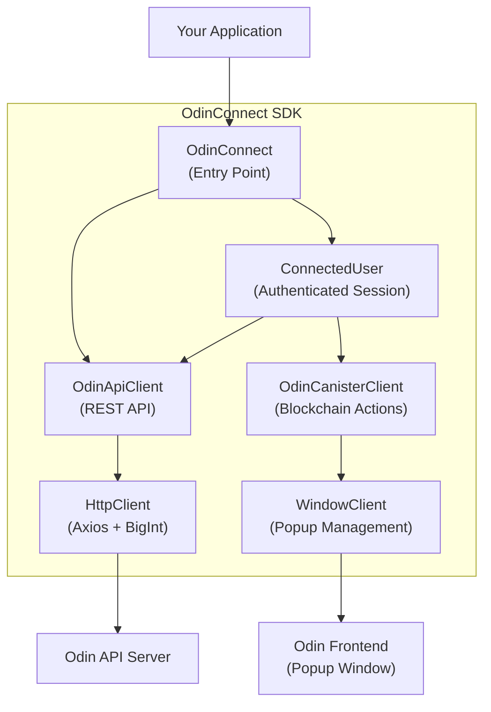
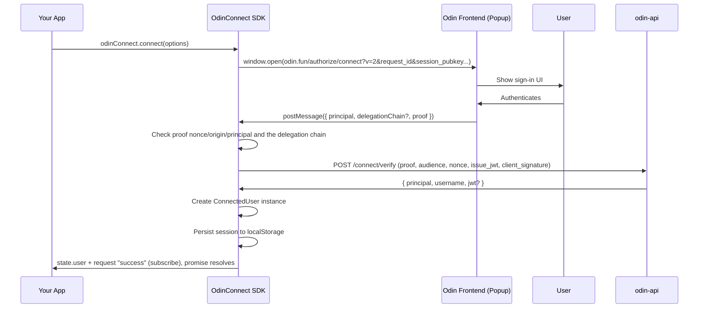
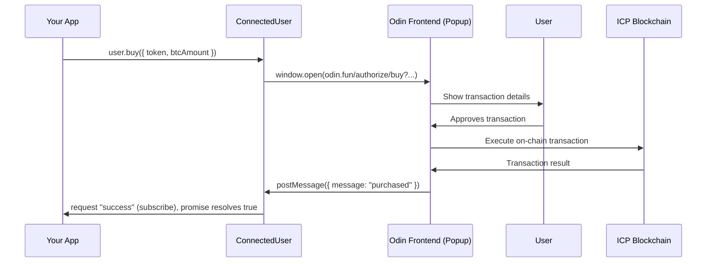
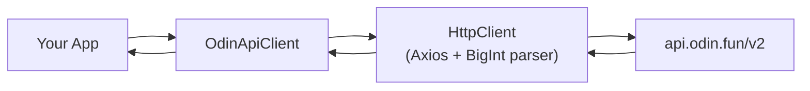

# OdinConnect

A TypeScript SDK for integrating with the [Odin](https://odin.fun) decentralized token platform on the Internet Computer (ICP). OdinConnect handles user authentication, token trading, liquidity management, and API interactions. Connect and action results land in one small state store you subscribe to (the same code for popups and wallet in-app browser redirects); data calls are plain promises.

## Table of Contents

- [Installation](#installation)
- [Architecture](#architecture)
- [How It Works](#how-it-works)
  - [Authentication Flow](#authentication-flow)
  - [Trading Action Flow](#trading-action-flow)
  - [API Request Flow](#api-request-flow)
- [Getting Started](#getting-started)
  - [React](#react)
- [Authentication](#authentication)
  - [Verified connect](#verified-connect)
  - [Wallet in-app browsers (redirect mode)](#wallet-in-app-browsers-redirect-mode)
- [State and sessions](#state-and-sessions)
- [Migrating to 2.0.0](#migrating-to-200)
- [Connected User Operations](#connected-user-operations)
  - [Fetching User Data](#fetching-user-data)
  - [Trading](#trading)
  - [Liquidity](#liquidity)
  - [Token Creation](#token-creation)
- [Public API](#public-api)
  - [Tokens](#tokens)
  - [Users](#users)
- [Utilities](#utilities)
- [Configuration](#configuration)
- [Types](#types)
- [Demo](#demo)
- [Starter Template](#starter-template)
- [General Notes](#general-notes)

## Installation

```bash
npm i odin-connect
```

## Architecture

OdinConnect is built with a layered architecture. Your application interacts with the `OdinConnect` class, which delegates to specialized internal services:


```mermaid
graph TB
    App["Your Application"]

    subgraph OdinConnect SDK
        OC["OdinConnect<br/>(Entry Point)"]
        CU["ConnectedUser<br/>(Authenticated Session)"]
        API["OdinApiClient<br/>(REST API)"]
        CAN["OdinCanisterClient<br/>(Blockchain Actions)"]
        WIN["WindowClient<br/>(Popup Management)"]
        HTTP["HttpClient<br/>(Axios + BigInt)"]
    end

    OdinAPI["Odin API Server"]
    OdinFE["Odin Frontend<br/>(Popup Window)"]

    App --> OC
    OC --> CU
    OC --> API
    CU --> API
    CU --> CAN
    CAN --> WIN
    WIN --> OdinFE
    API --> HTTP
    HTTP --> OdinAPI
```

| Component | Role |
|-----------|------|
| **OdinConnect** | Main entry point. Initializes the SDK with your app info and environment. |
| **ConnectedUser** | Returned after authentication. Provides user-scoped data fetching and trading actions. |
| **OdinApiClient** | Handles all REST API calls to `api.odin.fun`. Available both on the instance (`odinConnect.api`) and on the connected user. |
| **OdinCanisterClient** | Manages popup-based authorization for blockchain actions (buy, sell, transfer, etc.). |
| **WindowClient** | Wraps `window.open()` for cross-origin popup communication via `postMessage`. |
| **HttpClient** | Axios wrapper with automatic BigInt deserialization for large number fields. |

## How It Works

### Authentication Flow

When your app calls `connect()`, a popup opens to the Odin frontend where the user signs in (inside wallet in-app browsers the tab navigates there and back instead, see [redirect mode](#wallet-in-app-browsers-redirect-mode)). On success, Odin posts back the principal, a delegation chain (if requested) and a signed identity proof; the SDK verifies the proof with odin-api before it sets `state.user` (see [Verified connect](#verified-connect)).


```mermaid
sequenceDiagram
    participant App as Your App
    participant SDK as OdinConnect SDK
    participant Popup as Odin Frontend (Popup)
    participant User as User

    participant API as odin-api

    App->>SDK: odinConnect.connect(options)
    SDK->>Popup: window.open(odin.fun/authorize/connect?v=2&request_id&session_pubkey...)
    Popup->>User: Show sign-in UI
    User->>Popup: Authenticates
    Popup->>SDK: postMessage({ principal, delegationChain?, proof })
    SDK->>SDK: Check proof nonce/origin/principal and the delegation chain
    SDK->>API: POST /connect/verify (proof, audience, nonce, issue_jwt, client_signature)
    API->>SDK: { principal, username, jwt? }
    SDK->>SDK: Create ConnectedUser instance
    SDK->>SDK: Persist session to localStorage
    SDK->>App: state.user + request "success" (subscribe), promise resolves
```

**What gets returned depends on your options:**

| Option | What You Get |
|--------|-------------|
| `requires_api: true` | A JWT for authenticated API calls (image uploads, etc.), issued by odin-api after verification |
| `requires_delegation: true` | A `DelegationIdentity` for direct canister calls |
| Neither | Basic connection with user's principal |

### Trading Action Flow

Trading operations (buy, sell, transfer, swap, liquidity) each open a popup for the user to authorize the transaction:


```mermaid
sequenceDiagram
    participant App as Your App
    participant SDK as ConnectedUser
    participant Popup as Odin Frontend (Popup)
    participant User as User
    participant Chain as ICP Blockchain

    App->>SDK: user.buy({ token, btcAmount })
    SDK->>Popup: window.open(odin.fun/authorize/buy?...)
    Popup->>User: Show transaction details
    User->>Popup: Approves transaction
    Popup->>Chain: Execute on-chain transaction
    Chain->>Popup: Transaction result
    Popup->>SDK: postMessage({ message: "purchased" })
    SDK->>App: request "success" (subscribe), promise resolves true
```

If the user rejects the transaction, the popup sends `"rejected"`:
`state.request.status` becomes `"rejected"` and the promise rejects (as in
1.6.0).

Every authorize URL carries `v=2` and a fresh, random `request_id`. For
`icrcApprove()`, Odin sets the ICRC-2 memo to `sha256(request_id)`; the
result exposes the ledger block index as `state.request.detail.block_index`
(decimal string) and `detail.memo` (hex). The `icrcApprove()` promise still
resolves `true`.

### API Request Flow

API calls go through the HttpClient, which automatically handles BigInt deserialization for fields like `marketcap`, `volume`, and `balance`:


```mermaid
flowchart LR
    A["Your App"] --> B["OdinApiClient"]
    B --> C["HttpClient<br/>(Axios + BigInt parser)"]
    C --> D["api.odin.fun/v2"]
    D --> C
    C --> B
    B --> A
```

## Getting Started

One pattern for every browser. Results (a connect, a buy, an approval) land
in the SDK's state, whether they came back through a popup or, in wallet
in-app browsers, through a full-page redirect and reload. Render from that
state:

```typescript
import { OdinConnect } from "odin-connect";

// 1. Initialize. The constructor starts restoring the session (and, after a
//    redirect, verifying its result) right away.
const odin = new OdinConnect({ name: "My App", env: "prod" });

// 2. Render from state, now and on every change.
odin.subscribe(({ user, request }) => render(user, request));
await odin.ready();
render(odin.state.user, odin.state.request);

// 3. Start things from buttons; the outcome arrives through subscribe().
connectButton.onclick = () => odin.connect({ requires_api: true });
buyButton.onclick = () =>
  odin.user?.buy({ token: "2jjj", btcAmount: 10_000_000n });

function render(user, request) {
  // user: OdinConnectedUser | null
  // request: the latest connect() or action, e.g.
  //   { action: "buy", status: "success", input: { token, btcAmount } }
}
```

Data calls are plain promises:

```typescript
const balances = await odin.user?.getBalances({ page: 1, limit: 10 });
```

### React

```tsx
import { useSyncExternalStore } from "react";
import { OdinConnect } from "odin-connect";

const odin = new OdinConnect({ name: "My App", env: "prod" });

function App() {
  const { status, user, request } = useSyncExternalStore(
    odin.subscribe,
    odin.getState,
    odin.getState // server snapshot: stays "initializing" without a window
  );
  if (status === "initializing") return <Spinner />;
  return (
    <>
      {request && <p>{request.action}: {request.status}</p>}
      {user ? (
        <button onClick={() => user.buy({ token: "2jjj", btcAmount: 1_000n })}>
          Buy
        </button>
      ) : (
        <button onClick={() => odin.connect()}>Connect</button>
      )}
    </>
  );
}
```

`subscribe` and `getState` are bound, so they can be passed as is. Creating
the instance twice (React StrictMode) is fine: both share one redirect read
and odin-api is asked once.

## Authentication

### Initializing a new instance

```typescript
const odinConnect = new OdinConnect({
  name: "Demo App",   // Your app name (shown in auth popup)
  env: "prod",        // "prod" | "dev" | "local" | "legacy"
  lang: "en",         // Popup UI language: "en" | "zh" (default "en")
  mode: "auto",       // "auto" (default) | "popup" | "redirect", see below
});
```

### Popup language

All auth and action popups render in the language set via `lang`. It can be
changed at runtime; the new value applies to the next popup opened:

```typescript
const odinConnect = new OdinConnect({ name: "Demo App", lang: "zh" });

odinConnect.lang = "en"; // next popup renders in English
```

Unsupported values fall back to `"en"`. The SDK does not persist `lang` —
pass it on each construction from your app's own i18n state.

### Connecting a user

```typescript
odinConnect.connect({
  // window.open() settings for the auth popup
  open: {
    target: "_blank",
    settings: "height=800,width=400",
  },
  // Request a JWT for authenticated API calls
  requires_api: true,
  // Request a DelegationChain for direct canister interaction
  requires_delegation: false,
});
```

`state.request` becomes `{ action: "connect", status: "pending", input:
{ requires_api, requires_delegation, targets } }` at once and then settles:

| `status` | Meaning |
|----------|---------|
| `"success"` | Verified; `state.user` is the connected user. |
| `"rejected"` | The user declined in Odin. |
| `"failed"` | The popup could not open (blocked), or the redirect could not start; `error` says why. |
| `"unverified"` | Odin's answer failed verification (`error` says why). Not connected, nothing stored. |

`connect()` still returns a promise, as in 1.6.0: in popup mode it resolves
with the user or rejects. In redirect mode the tab navigates away and it
never settles. Build on `subscribe()` / `state`; the `await` is there so
existing popup code keeps working. Ignoring the promise never causes an
unhandled rejection.

### Getting a Delegation Identity

If you need to make direct calls to ICP canisters, request a delegation:

```typescript
odinConnect.connect({
  requires_delegation: true,
  targets: ["aaaa-aa"], // Canister IDs the delegation is scoped to
});

// once state.user is set:
const identity = odinConnect.user?.getIdentity();
// Use identity with @dfinity/agent
```

> [!IMPORTANT]
> **Every target canister must trust your app's origin.** Each canister listed in `targets` must return your app's origin from its [`icrc28_trusted_origins()`](https://github.com/dfinity/wg-identity-authentication) method. The Odin frontend verifies this against **all** targets before issuing a delegation.
>
> **Failure mode:** if any target does not list your origin (or does not implement ICRC-28), the authorize popup silently hides the action — no delegation is issued and no error is surfaced to your app. Ensure each target canister declares your origin before requesting `requires_delegation: true`.

### Verified connect

Since 2.0.0 a connect result is never taken on trust. A forged "connected as
X" (devtools, a crafted URL fragment) is rejected:

1. Every connect generates a session key in your page (with or without
   `requires_delegation`) and sends **only its public key** to Odin
   (`session_pubkey`). The secret never leaves the SDK.
2. Odin signs an identity proof with the user's Odin identity, bound to your
   origin (`aud`), to this request (`request_id` nonce) and to that session
   key (`sk` = the `session_pubkey` string). The SDK rejects a proof whose
   `sk` is missing or is not its own key.
3. With `requires_delegation`, the SDK checks the chain locally: not expired,
   issued to its own session key, rooted at the reported principal, and only
   scoped to the `targets` you asked for.
4. The SDK posts the proof to odin-api `POST /connect/verify` (on the same
   base URL as the other API calls) with `audience: window.location.origin`,
   `nonce: request_id`, `issue_jwt: requires_api` and `client_signature`:
   the session key's signature over `"odin-connect-verify:v1\n" + payload`.
   odin-api verifies the proof's signature (including Internet Identity
   canister signatures) and that `client_signature` matches the key in `sk`,
   rejects replays and returns `{ principal, username, jwt }`. The principal
   must match.
5. Only then is `state.user` set and the session persisted. With
   `requires_api`, the JWT comes from that API response; it never travels in
   a URL or `postMessage`.

The `sk` binding is what makes a leaked proof worthless. In redirect mode the
proof travels in the return URL's fragment, where browser history, extensions,
analytics capturing `location.href` or third-party scripts can read it before
the SDK does. Without the binding, whoever read it first could redeem it at
`/connect/verify` for the user's JWT. With it, redeeming the proof needs a
signature from the session secret, which stayed in your page (popup: in
memory; redirect: in that tab's `sessionStorage` until the result is read).

If any step fails, `state.request` is `{ action: "connect", status:
"unverified", error }` in both modes, and a popup `connect()` promise rejects
with an `OdinConnectVerificationError` ("OdinConnect could not verify the
connection: ..."). Nothing is stored.

### Wallet in-app browsers (redirect mode)

Some wallet in-app browsers (OKX) open `window.open` targets as a detached
page with no `window.opener`, so a popup can never send its result back.
There, the SDK navigates the tab to Odin and back instead ("redirect mode").
The default `mode: "auto"` does this only inside wallet in-app browsers and
app webviews and uses popups everywhere else. `mode` applies to `connect()`
**and every action** (buy, sell, transfer, swap, liquidity, ICRC-2 approve,
create token).

Nothing in your code changes for it: the
[Getting Started](#getting-started) pattern already covers it. Before
navigating, the SDK keeps the pending request (its `input`, `returnState` and
a one-time nonce) in that tab's `sessionStorage`. When Odin sends the tab
back, the new page's `OdinConnect` reads the result, verifies it (connect),
and `ready()` resolves with it as `state.request` (and `state.user` for a
connect). Subscribers are notified as usual.

```typescript
const odin = new OdinConnect({
  name: "My App",
  env: "prod",
  // mode: "auto" (default) | "popup" (never redirect) | "redirect" (always)
});
odin.subscribe(({ user, request }) => render(user, request));
await odin.ready();
// Read URL query state (?step=2) only after ready(): on the return from Odin
// the SDK puts the page's query string back.
render(odin.state.user, odin.state.request);

// A rejected connect comes back as request.status === "rejected". Show that,
// and do NOT call connect() automatically on that load, or a user who taps
// Reject is sent straight back to Odin.
```

- **No setup needed.** Redirect mode works for any app, like popups. For
  delegations, every target canister must still trust your origin
  (ICRC-28, see above). Pass `mode: "popup"` to opt out of redirect mode
  (popups still cannot return a result inside those wallet browsers).
- **Odin returns to the same page path; the SDK restores the query.** The
  SDK sends `return_url` as your page's origin and path only (no query, no
  fragment), because Odin refuses return URLs with a query string or
  fragment, or on another origin. Your page's full URL waits with the
  one-time nonce in `sessionStorage`, and once the result is read the SDK
  replaces the address (`history.replaceState`, `history.state` kept) with
  the original path and query. Read URL query state after `await ready()`,
  not before. A fragment on the original page is not restored.
- **Security: no open redirects on your origin.** Odin only returns to your
  origin and never with a query string, which stops `/go?to=...`-style open
  redirects from forwarding the result. Path-style redirects
  (`/redirect/https://evil.example`) are not blocked, so an app that uses
  redirect mode with delegations or API access must not have open-redirect
  pages on its origin.
- `mode` can be changed at runtime: `odinConnect.mode = "redirect"`.
- The result comes back in the URL fragment of the page that started the
  request. It is checked against the one-time nonce (sent as both `state` and
  `request_id`), removed from the address bar and, for connect, verified like
  a popup connect. A stale or foreign result (another tab, a replay, a
  tampered fragment) is removed from the URL and ignored: `request` stays
  `null`.
- Connect with `requires_api` or `requires_delegation` if users will run
  actions in redirect mode: a connect with neither is not persisted, so
  after the next redirect `state.user` is `null`.
- A rejected or unverified redirect connect keeps a previously stored
  session: `state.user` is that user, `state.request` tells what happened.
- Several `OdinConnect` instances for the same `slug` and `env` on one page
  load (React StrictMode) all get the same outcome, and odin-api is asked
  once. An app with another `slug` or `env` never sees it.
- A pending request that never got its result (the user left Odin) is
  deleted after 10 minutes, the next time the app loads without a result.
- In-memory page state is lost across the round trip (the query string is
  restored). `state.request.input` holds what the request was for; pass
  anything else the page needs to resume as `returnState` (see below).
- `requires_api` works in redirect mode: the JWT comes from odin-api, never
  from the URL.
- `"auto"` redirects when `isInAppBrowser()` is true: a known wallet user
  agent (OKX), an app webview (Android `; wv)`, iOS WebKit without
  `Safari/`), or a mobile browser with an injected wallet (`XverseProviders`,
  `btc_providers`, `unisat`, `okxwallet`, `phantom`, `ethereum`, ...). It errs
  toward redirect, which works everywhere. Call `isInAppBrowser()` yourself
  if you want to choose the mode.

#### Resuming a multi-step flow (`returnState`)

Every call takes an optional `returnState`, handed back as
`state.request.returnState` in both modes (never sent to Odin). In redirect
mode it is kept with the pending request in `sessionStorage`, so it must be
JSON-serializable; bigints are preserved:

```typescript
type Resume = { step: "approve"; token: string; amount: bigint };

// 1. From a button: start the action with what the page needs to resume.
odin.user?.icrcApprove({
  token,
  spender,
  amount,
  returnState: { step: "approve", token, amount } satisfies Resume,
});

// 2. In the subscriber (popup result, or the redirect result after reload).
odin.subscribe(({ request }) => {
  if (request?.action !== "icrc_approve") return;
  const resume = request.returnState as Resume | undefined;
  if (request.status === "success" && resume) {
    // request.detail?.block_index: ledger block of the approval
    goToStep("commit", { token: resume.token, amount: resume.amount });
  } else if (request.status !== "pending") {
    showError(request.error ?? "Approval was rejected");
  }
});
```

## State and sessions

```typescript
type OdinState = {
  status: "initializing" | "ready";
  user: OdinConnectedUser | null;
  request: OdinRequestState | null; // the latest request; a new one replaces it
};

type OdinRequestState = {
  id: string; // request_id
  action: "connect" | OdinAction; // "buy" | "sell" | "transfer" | "swap" |
  // "add_liquidity" | "remove_liquidity" | "icrc_approve" | "create_token"
  status: "pending" | "success" | "rejected" | "failed" | "unverified";
  input: /* per action, see below */;
  detail?: OdinActionDetail; // icrc_approve: { block_index, memo }
  returnState?: unknown;
  error?: string; // for "failed" and "unverified"
};
```

| Member | |
|--------|-|
| `ready(): Promise<OdinState>` | Restores the stored session and applies a redirect result. Started by the constructor; idempotent; never rejects. Without a redirect result the state is `"ready"` right after construction. |
| `state` / `getState()` | The current snapshot. A new frozen object after every change, the same object in between (what `useSyncExternalStore` needs). |
| `subscribe(listener)` | Calls `listener(state)` after every change, not on subscribe (read `state` after `await ready()`). Returns the unsubscribe function. |
| `user` | `state.user`. |
| `disconnect()` | Clears the stored session and the API key; `user` and `request` become `null`. |
| `isSessionValid()` | A non-expired session exists in storage. |

`input` is what the call was given, without `returnState` and the
principal; amounts stay `bigint`, also across a redirect:

| `action` | `input` |
|----------|---------|
| `connect` | `{ requires_api, requires_delegation, targets }` |
| `buy` | `{ token, btcAmount }` |
| `sell` | `{ token, tokenAmount }` |
| `transfer` | `{ token, amount, destination }` |
| `swap` | `{ fromToken, toToken, fromAmount }` |
| `add_liquidity` | `{ token, btcAmount }` |
| `remove_liquidity` | `{ token, lpAmount }` |
| `icrc_approve` | `{ token, spender, amount }` |
| `create_token` | the token fields, with `image` = the uploaded image URL (never the `File`; set once the upload finished) |

An action is `"success"` when Odin confirms it, `"rejected"` when the user
declines, and `"failed"` otherwise (popup blocked, Odin reported an error, a
`createToken` validation or upload error). The `user.<action>()` promises
work as in 1.6.0: popup mode resolves `true` or rejects; redirect mode never
settles.

### Session persistence

A verified `connect()` with `requires_api` or `requires_delegation` is
persisted to `localStorage`, and `ready()` restores it on the next load
(including sessions stored by 1.6.0 and 1.7.0). A connect with neither is
kept in memory only. A new verified connect replaces the stored session.

```typescript
if (odinConnect.isSessionValid()) {
  // A non-expired session exists in storage
}

// Clears persisted session data, the API key, state.user and state.request
odinConnect.disconnect();
```

### Custom app slug

Storage keys are scoped by a slug derived from your app name (e.g. `"My App"` becomes `"my-app"`). You can provide a custom slug to control the storage key:

```typescript
const odinConnect = new OdinConnect({
  name: "My App",
  slug: "myapp-v2", // Storage key: odin_connect:myapp-v2:prod:session
  env: "prod",
});
```

> **Notes:**
> - Sessions with a delegation chain are automatically invalidated when the delegation expires.
> - Calling `disconnect()` in one tab clears the session for all tabs on the same origin.
> - In environments where `localStorage` is unavailable (SSR, strict privacy mode), session persistence is silently skipped.
> - On a server (no `window`) the constructor does not touch the browser and `state` stays `"initializing"`.

## Migrating to 2.0.0

2.0.0 makes connect results verifiable, stops sending secrets through URLs,
supports wallet in-app browsers by default, and delivers every result
through one state store. It needs the Odin frontend and odin-api that
support `v=2` (already deployed before this release).

Upgrading from 1.6.0 / 1.7.0:

1. `npm install odin-connect@2`.
2. Replace `odinConnect.restoreSession()` with
   `const { user } = await odinConnect.ready();`. Or keep
   `await odinConnect.restoreSession()` (now async and deprecated; it
   resolves with `state.user` after `ready()`). Stored sessions from 1.6.0 /
   1.7.0 still restore.
3. Popup-only code that awaits `connect()` and actions keeps working
   unchanged.
4. To support wallet in-app browsers (redirect mode, the default there),
   render results from `state` / `subscribe()` as in
   [Getting Started](#getting-started): a redirect reloads the page, so an
   awaited call never returns there. To keep popups everywhere instead, pass
   `mode: "popup"`.
5. If your page reads URL query state on load, read it after
   `await odinConnect.ready()`: Odin returns to the page path without the
   query, and the SDK restores it.

Details:

- **Default `mode` is `"auto"`** (was `"popup"`): redirect mode inside wallet
  in-app browsers and app webviews (`isInAppBrowser()`), popups elsewhere.
  `"popup"` and `"redirect"` remain explicit overrides.
- **New state API:** `ready()`, `state`, `getState()`, `subscribe()`, `user`
  (see [State and sessions](#state-and-sessions)). Popup and redirect results
  both land in `state.request`.
- **`restoreSession()` is async and deprecated** (`Promise<OdinConnectedUser
  | null>`, the same as `(await ready()).user`).
- **`connect()` rejects when its popup is blocked** ("Failed to open
  authorize/connect window, please always allow popups and try again"), like
  the actions always did.
- **A new connect replaces the stored session.** The previous user's JWT
  and delegation are cleared once the new connect is verified, even if the
  new connect asks for neither. `requires_api` fails verification when
  odin-api issues no JWT.
- **New request status `"unverified"`**: the connect result could not be
  verified, the user is not connected and nothing was stored. Popup
  `connect()` rejects with an `OdinConnectVerificationError` in the same
  cases.
- **`requires_api` is allowed in redirect mode.** The JWT is issued by
  odin-api (`POST /connect/verify`) and never appears in a URL or message.
- **`session_key` is no longer sent.** Odin receives `session_pubkey` (public
  key only) on every connect, and the identity proof is bound to it. Every
  authorize URL carries `v=2` and a `request_id`.
- **Action results can carry `detail`.** `icrc_approve` results expose
  `state.request.detail.block_index` and `detail.memo`. Popup actions still
  resolve `true`.
- `connect()` now calls odin-api once per connection, so the app must be able
  to reach `api.odin.fun` (CSP `connect-src`).

## Connected User Operations

Once connected, `odinConnect.user` (`state.user`) is a `ConnectedUser` with the following capabilities:

### Fetching User Data

All data methods accept a `{ page, limit }` pagination object:

```typescript
const profile       = await user.getUser();
const balances      = await user.getBalances({ page: 1, limit: 10 });
const balance       = await user.getBalance("2jjj"); // Single token balance (or null)
const tokens        = await user.getTokens({ page: 1, limit: 10 });
const createdTokens = await user.getCreatedTokens({ page: 1, limit: 10 });
const liquidity     = await user.getLiquidity({ page: 1, limit: 10 });
const activity      = await user.getActivity({ page: 1, limit: 10 });
const achievements  = await user.getAchievements({ page: 1, limit: 10 });
const transactions  = await user.getTransactions({ page: 1, limit: 10 });
const stats         = await user.getStats();
const avatarUrl     = user.buildAvatarImageUrl(); // sync, env-aware CDN URL
```

#### Token image URL

Token images are not user-scoped, so build them with the `OdinUtils.buildTokenImageUrl` utility from a token id. Pass the target env (defaults to `"prod"`):

```typescript
import { OdinUtils } from "odin-connect";

const imageUrl = OdinUtils.buildTokenImageUrl("2jjj"); // env-aware CDN URL (prod)
const devUrl   = OdinUtils.buildTokenImageUrl("2jjj", odinConnect.currentEnv);
```

#### Getting the BTC balance

BTC is a regular token with the id `"btc"`, so fetch it with `getBalance`:

```typescript
// Connected user
const btc = await user.getBalance("btc"); // Balance | null (null = no BTC held)

// Or with the read-only API client (no auth required)
const btc = await odinConnect.api.getBalance(principal, "btc");
```

`balance` is a `bigint` in **millisatoshis** (1 BTC = 100,000,000,000 millisats).
Convert to BTC for display:

```typescript
const asBtc = btc ? Number(btc.balance) / 1e11 : 0;
```

> See [General Notes](#general-notes) — all BTC amounts are in millisatoshis.

### Trading

#### Buy tokens

```typescript
await user.buy({
  btcAmount: 10_000_000n, // Amount in millisatoshis
  token: "2jjj",
});
```

#### Sell tokens

```typescript
await user.sell({
  tokenAmount: 20_000_000n,
  token: "2jjj",
});
```

#### Transfer tokens

```typescript
await odinConnect.transfer({
  principal: "veyov-kjgrf-hke6v-6d63i-sdwae-oldgg-huau6-ke5g3-rllp2-5jhca-uqe",
  destination: "vv5jb-7sm7u-vn3nq-6nflf-dghis-fd7ji-cx764-xunni-zosog-eqvpw-oae",
  token: "2jjj",
  amount: 20_000_000n,
});
```

#### Swap tokens

```typescript
await user.swap({
  fromToken: "2jjj",
  toToken: "abc1",
  fromAmount: 10_000_000n,
});
```

#### Approve a spender (ICRC-2)

Authorizes a `spender` to transfer up to `amount` of a token on the user's behalf. The user's `principal` is supplied automatically from the connected session.

```typescript
await user.icrcApprove({
  token: "2jjj",       // Token to approve
  spender: "veyov-kjgrf-hke6v-6d63i-sdwae-oldgg-huau6-ke5g3-rllp2-5jhca-uqe", // Principal allowed to spend
  amount: 20_000_000n, // Allowance in millisatoshis
});
```

### Liquidity

#### Add liquidity

```typescript
await user.addLiquidity({
  btcAmount: 20_000_000n,
  token: "2jj",
});
```

#### Remove liquidity

```typescript
await user.removeLiquidity({
  btcAmount: 20_000_000n,
  token: "2jj",
});
```

### Token Creation

> **Note:** `requires_api` must be set to `true` when connecting.

```typescript
const user = await odinConnect.connect({ requires_api: true });

await user.createToken({
  image: file,        // A File (PNG, JPEG, WebP, GIF, SVG, or AVIF; max 200KB)
  principal: "veyov-kjgrf-hke6v-6d63i-sdwae-oldgg-huau6-ke5g3-rllp2-5jhca-uqe",
  name: "Test Token",       // 3-30 characters
  ticker: "TEST",           // 3-10 uppercase alphanumeric, at least 2 letters
  vanity_ticker: "",        // Optional, 1-10 characters (any unicode), no surrounding whitespace
  description: "A test token",  // Optional, max 100 characters
  website: "https://example.com",  // Optional, valid URL
  telegram: "",             // Optional, valid Telegram URL
  twitter: "",              // Optional, valid Twitter/X URL
  buy: 20_000_000n,         // Optional, pre-buy amount in millisats
  discount: "",             // Optional, 10 alphanumeric characters
});
```

## Public API

The API client is available at `odinConnect.api` and does **not** require authentication for read operations.

### Tokens

```typescript
// List tokens with sorting and filtering
const tokens = await odinConnect.api.getTokens(
  { page: 1, limit: 10 },         // Pagination
  { field: "marketcap", direction: "desc" },  // Sort (optional)
  { marketcap_min: 100_000_000n }  // Filters (optional)
);

// Get a single token by ID
const token = await odinConnect.api.getToken("2jjj");
```

**Available sort fields:** `marketcap`, `volume`, `price`, `holder_count`, `created_time`

**Available filters:**

| Filter | Type | Description |
|--------|------|-------------|
| `ascended` | `boolean` | Token has ascended |
| `etched` | `boolean` | Token has been etched |
| `external` | `boolean` | External (Bitcoin) token |
| `verified` | `boolean` | Verified token |
| `has_website` | `boolean` | Has a website |
| `has_twitter` | `boolean` | Has a Twitter account |
| `has_telegram` | `boolean` | Has a Telegram group |
| `marketcap_min` / `marketcap_max` | `bigint` | Market cap range (millisats) |
| `volume_min` / `volume_max` | `bigint` | Volume range (millisats) |
| `holders_min` / `holders_max` | `number` | Holder count range |
| `price_min` / `price_max` | `number` | Price range |
| `search` | `string` | Search by name or ticker |

### Users

```typescript
// Get activities (no principal required)
const activity = await odinConnect.api.getUserActivity({
  pagination: { page: 1, limit: 10 },
});

// Get token by id
const token = await odinConnect.api.getToken("2jjj");

// Get user profile by id
const user = await odinConnect.api.getUser(
  "veyov-kjgrf-hke6v-6d63i-sdwae-oldgg-huau6-ke5g3-rllp2-5jhca-uqe"
);

// Get user balances by user id
const balances = await odinConnect.api.getBalances(
  "veyov-kjgrf-hke6v-6d63i-sdwae-oldgg-huau6-ke5g3-rllp2-5jhca-uqe",
  { page: 1, limit: 20 }
);

// Get balance for a specific token (returns Balance or null)
const balance = await odinConnect.api.getBalance(
  "veyov-kjgrf-hke6v-6d63i-sdwae-oldgg-huau6-ke5g3-rllp2-5jhca-uqe",
  "2jjj"
);

// Get activities by user id
const activity = await odinConnect.api.getUserActivity(
  "veyov-kjgrf-hke6v-6d63i-sdwae-oldgg-huau6-ke5g3-rllp2-5jhca-uqe",
  { page: 1, limit: 10 }
);

// Get transactions by user id
const transactions = await odinConnect.api.getUserTransactions(
  "veyov-kjgrf-hke6v-6d63i-sdwae-oldgg-huau6-ke5g3-rllp2-5jhca-uqe",
  { page: 1, limit: 10 }
);

// Get user stats
const stats = await odinConnect.api.getUserStats(
  "veyov-kjgrf-hke6v-6d63i-sdwae-oldgg-huau6-ke5g3-rllp2-5jhca-uqe"
);
```

## Utilities

OdinConnect exports utility functions under `OdinUtils`:

```typescript
import { OdinUtils } from "odin-connect";

// Convert a decimal amount to the on-chain bigint representation
const amount = OdinUtils.convertToOdinAmount("1.5", token);
// For a token with decimals=3, divisibility=8 → 150_000_000_000n
```

### Token Field Validators

Validators are available for token creation fields:

```typescript
import { OdinUtils } from "odin-connect";

OdinUtils.createTokenValidators.name("My Token");        // 3-30 chars
OdinUtils.createTokenValidators.ticker("TEST");           // 3-10 uppercase alphanumeric
OdinUtils.createTokenValidators.vanity_ticker("Tëst🚀");   // Optional, max 10 unicode code points, no surrounding whitespace
OdinUtils.createTokenValidators.image(file);              // PNG/JPEG/WebP/GIF/SVG/AVIF, max 200KB
OdinUtils.createTokenValidators.description("A token");   // Max 100 chars
OdinUtils.createTokenValidators.website("https://...");   // Valid URL
OdinUtils.createTokenValidators.twitter("https://x.com/...");
OdinUtils.createTokenValidators.telegram("https://t.me/...");
```

## Configuration

### Environments

| Environment | Frontend URL | API Base URL |
|-------------|-------------|-------------|
| `prod` (default) | `https://odin.fun` | `https://api.odin.fun/v2` |
| `dev` | `https://dev.odin.fun` | `https://api.odin.fun/dev` |
| `local` | `http://localhost:5173` | `https://api.odin.fun/dev` |
| `legacy` | `https://legacy.odin.fun` | `https://api.odin.fun/v1` |

```typescript
const odinConnect = new OdinConnect({
  name: "My App",
  env: "dev", // Use development environment
});
```

## Types

All types are exported with the `Odin` prefix:

```typescript
import type {
  OdinUser,
  OdinBalance,
  OdinBaseToken,
  OdinToken,
  OdinTokenWithBalance,
  OdinActivity,
  OdinTransaction,
  OdinAchievement,
  OdinAchievementCategory,
  OdinConnectedUser,
  OdinState,
  OdinRequestState,
  OdinRequestStatus,
  OdinRequestInput,
  OdinAction,
  OdinActionDetail,
  SessionData,
} from "odin-connect";
```

## Demo

This repository includes a working demo application in the `/demo` folder.

```bash
# Build the library and start the demo dev server
npm run demo

# Or run just the demo (if already built)
npm run demo:start
```

## Starter Template

Bootstrap a new app with [odin-app-template](https://github.com/Toniq-Labs/odin-app-template/) — a ready-to-clone scaffold wiring up OdinConnect. Live example: [odin-app-template.netlify.app](https://odin-app-template.netlify.app).

## General Notes

- All BTC amounts are in **millisatoshis** (1 BTC = 100,000,000,000 millisats)
- All trading actions (buy, sell, transfer, swap, liquidity) open a popup (or redirect) for user authorization; the outcome lands in `state.request`, and the popup-mode promise resolves `true` or rejects
- API data methods return paginated results; pass `{ page, limit }` to control pagination
- The SDK uses `postMessage` for secure cross-origin communication between your app and the Odin frontend popup
- BigInt fields (balances, amounts, market caps) are automatically deserialized from JSON
